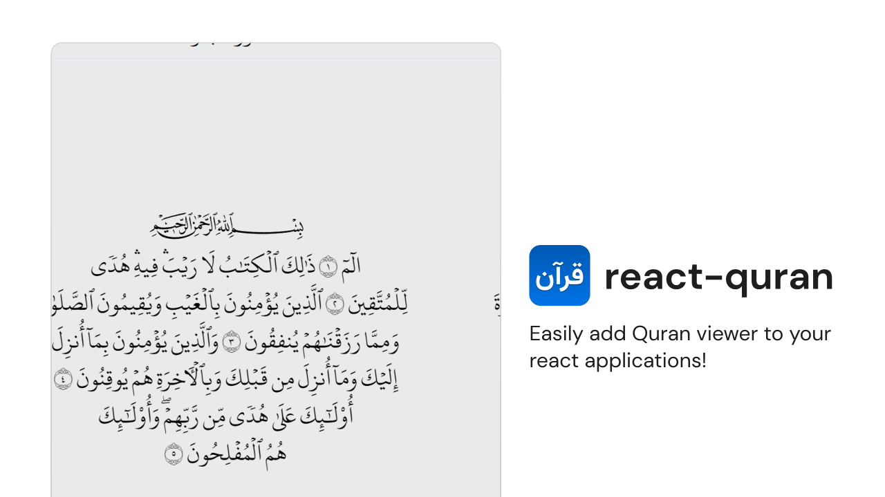

<div align="center">


<br />

<h3 style="font-size: 40px;"> React Quran</h3>

Easily add Quran viewer to your react applications!

</div>

---

## Installation

```bash
# via npm
npm install react-quran

# via yarn
yarn add react-quran

# via pnpm
pnpm add react-quran
```

## Features

- ⚡ **High-Quality Text Rendering:** Uses the official Hafs font of the Mushaf, avoiding the use of SVGs to ensure high-customizability.
- 🎨 **Customizable Layout:** Easily adjust the styles to fit your app needs.
- 📦 **Lightweight and Fast:** Designed to have a minimal impact on your application's performance.
- 📘 **TypeScript Support:** Fully compatible with TypeScript.

## Usage

```jsx
// import styles; which imports the font of the quran.
import 'react-quran/fonts/index.css'

// import the ReadingView component
import { ReadingView } from 'react-quran'

const App = () => {
    return (
        <div>
            <ReadingView
                page={2}
                readingViewStyles={{
                    width: '512px',
                    maxWidth: '100%',
                    backgroundColor: 'hsl(200 5% 90% / 1)',
                    borderRadius: 8,
                }}
                surahTitleStyles={{
                    color: 'black',
                }}
                fixedAspectRation={true}
            />
        </div>
    )
}

export default App
```

<br />

## Contribute

Contributions are welcome! Feel free to submit [issues](https://github.com/6km/react-quran/issues) or [pull requests](https://github.com/6km/react-quran/pulls).

## License

Distributed under the MIT License. See [LICENSE](./LICENSE) for more information.
