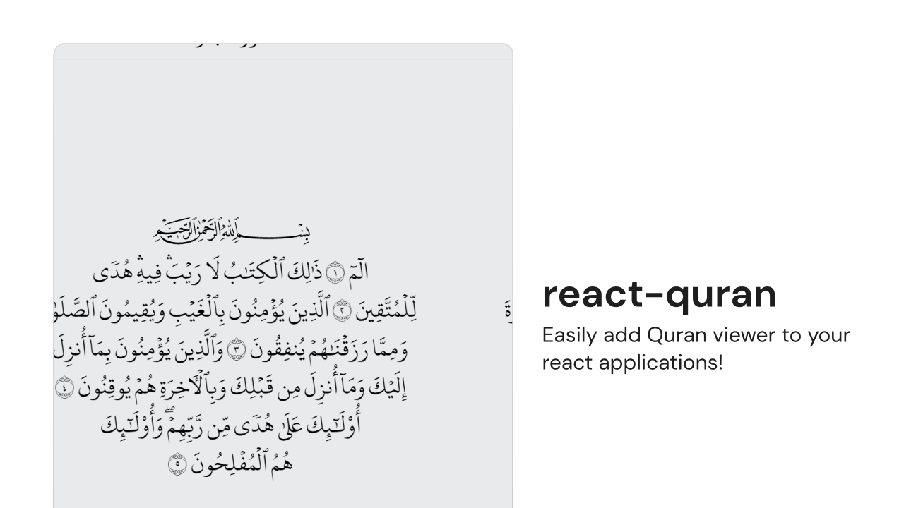

<div align="center">
  <picture>
    <source media="(prefers-color-scheme: dark)" srcset="images/banner-dark.svg">
    <source media="(prefers-color-scheme: light)" srcset="images/banner-light.svg">
    
  </picture>
  <br />
  <h3>react-quran</h3>
  Easily add Quran viewer to your react applications!
</div>
<br />
<br />

## Installation

```bash
# via npm
npm install react-quran

# via yarn
yarn add react-quran

# via pnpm
pnpm add react-quran
```

## Features

- 📦 **High-Quality Text Rendering:**
  Uses the official Hafs font of the Mushaf, avoiding the use of SVGs to ensure high-customizability.
- 🎨 **Customizable Layout:**
  Easily adjust the styles to fit your app needs.
  This is only intended to be used to implement dark and light mode.
- 📦 **Lightweight and Fast:**
  Designed to have a minimal impact on your application's performance.
- 📘 **TypeScript Support:**
  Fully compatible with TypeScript.

## Usage

```jsx
// Import styles; which imports the font of the quran.
import 'react-quran/fonts/index.css'

// Import the ReadingView component.
import { ReadingView } from 'react-quran'

const App = () => {
    return (
        <div>
            <ReadingView
                page={2}
                readingViewStyles={{
                    width: '512px',
                    maxWidth: '100%',
                    backgroundColor: 'hsl(200 5% 90% / 1)',
                    borderRadius: 8,
                }}
                surahTitleStyles={{
                    color: 'black',
                }}
                fixedAspectRation={true}
            />
        </div>
    )
}

export default App
```

## Contribute

Contributions are welcome! Feel free to submit [issues](https://github.com/6km/react-quran/issues) or [pull requests](https://github.com/6km/react-quran/pulls).

## Thanks

This could not have been achieved without the grace of Allāh, who helped us to do this, and then the valuable resources that help achieve digital solutions for Muslims and Islam. May allah bless them with His mercy. While not all resources used during development are remembered, here are the ones that come to mind.

- [King Fahd Glorious Qur'an Printing Complex](https://qurancomplex.gov.sa/techquran/dev/)
  for providing the Uthmani font of the Qur'ān and data of the verses and chapters.
- [Quran.com](https://quran.com/)
  for providing their useful API which is used to get verses of the Qur'ān line-by-line.
- [Tanzil](https://tanzil.net/)
  for providing a lot of valudable data such as Qur'ān text


If you have any useful resources that can make this project better, please open an [issues](https://github.com/6km/react-quran/issues) and share it!

## License

Distributed under the MIT License. See [LICENSE](./LICENSE) for more information.
